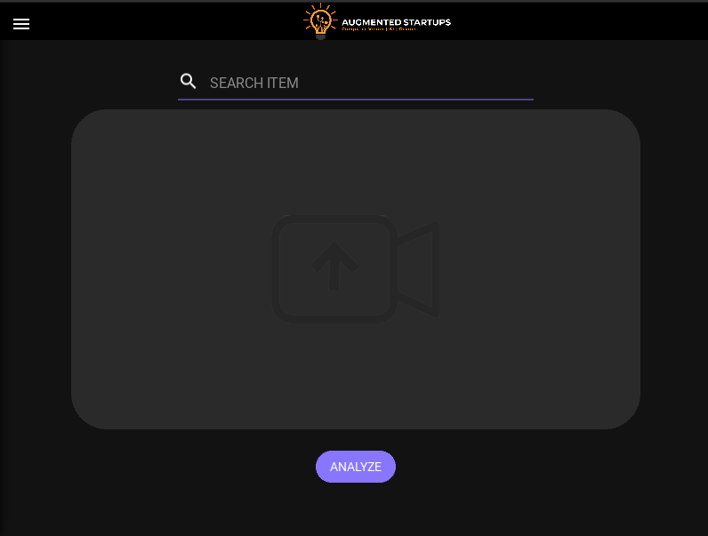
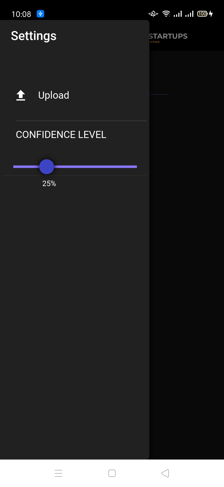

# SearchApp

SearchApp is a Python application for object detection on videos using YOLOv8n.

This app can be used in different platforms like Android, Ios, Ubuntu, Windows, ..

## Prerequisites

- Python 3
- Kivy
- KivyMD
- OpenCV
- TensorFlow
- TensorFlow Lite

## Usage

1. Clone the repository:

   ```sh
   git clone https://github.com/WikiGenius/SearchApp.git


2. Install the dependencies:

   ```sh
   pip install -r requirements.txt
    

3. Run the application:

python main.py

4. Load a video file by clicking on the "Upload Video" button.

5. Enter object classes separated by commas in the text input and click on the "Find Object" button to filter the object classes.

## Screenshots






## Author
- Muhammed Elyamani
- GitHub: https://github.com/WikiGenius